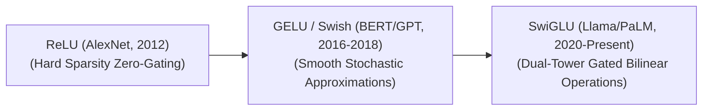

# Awesome-SwiGLU-Activation
## SwiGLU Activation Function: Evolution, Variants, Types, & Applications

SwiGLU (Swish Gated Linear Unit) is an advanced neural network activation function that serves as a cornerstone components in the feed-forward networks (FFN) of modern Large Language Models (LLMs). Introduced by Noam Shazeer in 2020 ("GLU Variants Improve Transformer"), SwiGLU combines the properties of the **Swish** activation function with a **Gated Linear Unit (GLU)** framework. By utilizing a gating mechanism where one linear projection dynamically modulates the information flow of another via a non-linear activation element-wise, SwiGLU enhances gradient flow, improves mathematical capacity, and drives faster convergence speeds compared to traditional ReLU or GELU alternatives.

---

## 1. The Chronological Evolution

The implementation of non-linear activation mechanisms within deep learning architectures has transitioned from rigid bounding gates to smooth stochastic approximations, moving toward high-capacity gated dual-tower operations.

*   **The Hard Sparsity Era (ReLU, ~2012–2016)**
    *   *Concept:* The foundation era. Rectified Linear Units ($\max(0, x)$) introduced absolute sparsity by completely zeroing out negative inputs.
    *   *Limitation:* Suffered from the **Dying ReLU problem**, where neurons receiving consistently negative inputs update to zero gradients, permanently deactivating components of the network during training loops.
*   **The Smooth Stochastic Era (GELU / Swish, ~2016–2020)**
    *   *Concept:* Introduced smooth, non-monotonic curves that allow minor negative activations to propagate. **GELU** (Gaussian Error Linear Unit) scales inputs by a cumulative Gaussian distribution function, while **Swish** (SiLU) implements a parameterized sigmoid multiplication ($x \cdot \sigma(\beta x)$).
    *   *Limitation:* Operated on single, isolated tensor inputs, missing out on the multi-dimensional feature-routing capabilities found in gated network topologies.
*   **The Gated Linear Unit Revolution (SwiGLU, 2020–Present)**
    *   *Concept:* Combined the Swish curve with a dual-tower Gated Linear Unit framework. The architecture splits the hidden feature path into two parallel linear matrix operations, passes one path through a Swish activation, and computes an element-wise multiplication (Hadamard product) between both paths.
    *   *Significance:* The standard baseline activation layout for modern frontier architectures (e.g., Llama 3, Mistral, Gemma, DeepSeek).

---

## 2. Core GLU Family Variants

The mathematical framework introduced by Shazeer outlines several variations of Gated Linear Units, distinguished exclusively by the underlying non-linear activation function used within the gating path.

*   **SwiGLU (Swish-Gated Linear Unit)**
    *   *Equation:* $\text{SwiGLU}(x) = (\text{Swish}_{\beta}(xW) \otimes xV)$
    *   *Mechanism:* Utilizes the Swish function as the gating mechanism. It demonstrates superior empirical convergence behaviors across long-context language modeling tokens.
*   **GEGLU (GELU-Gated Linear Unit)**
    *   *Equation:* $\text{GEGLU}(x) = (\text{GELU}(xW) \otimes xV)$
    *   *Mechanism:* Substitutes Swish with the Gaussian Error Linear Unit function. It serves as a prominent activation layer variant across generative computer vision stacks.
*   **ReGLU (ReLU-Gated Linear Unit)**
    *   *Equation:* $\text{ReGLU}(x) = (\max(0, xW) \otimes xV)$
    *   *Mechanism:* Deploys standard ReLU within the gate, combining classical hard-zero sparsity parameters with modern bilinear multi-path structures.

---

## 3. Structural FFN Layer Architecture Modifications

Integrating a GLU-style activation function alters the underlying structural configuration and parameter distribution of a Transformer's Feed-Forward Network (FFN) layer.

*   **The 3-Matrix FFN Shift**
    *   *Traditional FFN Layout (ReLU/GELU):* Requires exactly two linear projection matrix allocations: a gate-up projection ($W_1$) and a downstream down-projection ($W_2$).
    *   *SwiGLU FFN Layout:* Requires **three separate weight matrices** to compute a single layer transformation:
        1.  $W_{gate}$: Generates the gating matrix channel.
        2.  $W_{up}$: Generates the parallel value transformation channel.
        3.  $W_{down}$: Combines and projects the gated Hadamard output back to the model's base dimension.
*   **Parameter Budget Calibration**
    *   *The Balancing Act:* Because SwiGLU introduces a third matrix, keeping the total parameter count identical to a traditional FFN requires reducing the intermediate hidden layer dimension ($d_{ffn}$). 
    *   *The Standard Formula:* The hidden capacity is traditionally set to approximately $\frac{8}{3}d_{model}$ (rather than the standard $4d_{model}$ used in classic architectures) to maintain computational parity.

---

## 4. Production Engineering Challenges & Hardware Solutions

While SwiGLU yields notable accuracy gains on paper, its dual-tower structure introduces explicit system-level memory and computational boundaries.

*   **The VRAM Memory Footprint Inflation**
    *   *The Problem:* Because the forward pass instantiates two large parallel tensor chunks before computing the element-wise multiplication, intermediate **activation memory consumption** swells during training loops, increasing the frequency of Out-Of-Memory errors.
    *   *Mitigation:* Implementing **Activation Checkpointing** (discarding intermediate split tensors and recomputing them during backpropagation) or utilizing model compiler optimizations like `torch.compile` to merge tracking graphs.
*   **GPU Memory Bandwidth Bottlenecks**
    *   *The Problem:* Executing separate, disjointed PyTorch operators for linear projection, Swish exponentiation, and tensor multiplication forces the GPU to write data out to slow High Bandwidth Memory (HBM) repeatedly, stalling processing speeds.
    *   *Mitigation:* Deploying hardware-fused kernels (such as **Liger Kernel** or custom Triton scripts). These compile the up-projection, activation scaling, and Hadamard product into a single GPU SRAM execution block, maximizing throughput.

---

## 5. Frontier Real-World Applications

*   **Autoregressive LLM Base Pre-Training Foundations**
    *   *Application:* Serves as the default non-linear computation engine inside state-of-the-art base models. SwiGLU's smooth mathematical landscape allows models to train stably over trillions of tokens without encountering sudden gradient explosions.
*   **High-Yield Code Generation & Synthesis Blocks**
    *   *Application:* Deployed within specialized software engineering networks. The enhanced multi-path capacity of gated linear units excels at tracking structured code indentation shifts, syntax logic boundaries, and explicit variable compilation rules.
*   **Mixture-of-Experts (MoE) Token Routing Networks**
    *   *Application:* Integrated directly into the dense expert blocks of massive Mixture-of-Experts models (like DeepSeek-V3 or Mixtral). SwiGLU processes the activated sparse routing selections efficiently, scaling token computation throughput across deep distributed network nodes.

