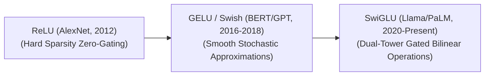

# Awesome-SwiGLU-Activation
## SwiGLU Activation Function: Evolution, Variants, Types, & Applications

SwiGLU (Swish Gated Linear Unit) is an advanced neural network activation function that serves as a cornerstone components in the feed-forward networks (FFN) of modern Large Language Models (LLMs). Introduced by Noam Shazeer in 2020 ("GLU Variants Improve Transformer"), SwiGLU combines the properties of the **Swish** activation function with a **Gated Linear Unit (GLU)** framework. By utilizing a gating mechanism where one linear projection dynamically modulates the information flow of another via a non-linear activation element-wise, SwiGLU enhances gradient flow, improves mathematical capacity, and drives faster convergence speeds compared to traditional ReLU or GELU alternatives.

---

## 1. The Chronological Evolution

The implementation of non-linear activation mechanisms within deep learning architectures has transitioned from rigid bounding gates to smooth stochastic approximations, moving toward high-capacity gated dual-tower operations.

| Era / Concept | First Used | Paper / Reference |
| :--- | :---: | :--- |
| **[The Hard Sparsity Era (ReLU, ~2012–2016)](./details/hard_sparsity_relu.md)** • *Concept:* The foundation era. Rectified Linear Units ($\max(0, x)$) introduced absolute sparsity by completely zeroing out negative inputs. • *Limitation:* Suffered from the **Dying ReLU problem**, where neurons receiving consistently negative inputs update to zero gradients, permanently deactivating components of the network during training loops. | 2012 | [ImageNet Classification with Deep Convolutional Neural Networks](https://papers.nips.cc/paper/2012/hash/c3992e9a68c5ae12bd18488bc579b30d-Abstract.html) (Krizhevsky et al., 2012) |
| **[The Smooth Stochastic Era (GELU / Swish, ~2016–2020)](./details/smooth_stochastic_gelu_swish.md)** • *Concept:* Introduced smooth, non-monotonic curves that allow minor negative activations to propagate. **GELU** (Gaussian Error Linear Unit) scales inputs by a cumulative Gaussian distribution function, while **Swish** (SiLU) implements a parameterized sigmoid multiplication ($x \cdot \sigma(\beta x)$). • *Limitation:* Operated on single, isolated tensor inputs, missing out on the multi-dimensional feature-routing capabilities found in gated network topologies. | 2016 (GELU) 2017 (Swish) | [Gaussian Error Linear Units (GELUs)](https://arxiv.org/abs/1606.08415) (Hendrycks & Gimpel, 2016) [Searching for Activation Functions](https://arxiv.org/abs/1710.05941) (Ramachandran et al., 2017) |
| **[The Gated Linear Unit Revolution (SwiGLU, 2020–Present)](./details/glu_revolution_swiglu.md)** • *Concept:* Combined the Swish curve with a dual-tower Gated Linear Unit framework. The architecture splits the hidden feature path into two parallel linear matrix operations, passes one path through a Swish activation, and computes an element-wise multiplication (Hadamard product) between both paths. • *Significance:* The standard baseline activation layout for modern frontier architectures (e.g., Llama 3, Mistral, Gemma, DeepSeek). | 2020 | [GLU Variants Improve Transformer](https://arxiv.org/abs/2002.05202) (Shazeer, 2020) |

---

## 2. Core GLU Family Variants

The mathematical framework introduced by Shazeer outlines several variations of Gated Linear Units, distinguished exclusively by the underlying non-linear activation function used within the gating path.

| Variant | First Used | Paper / Reference |
| :--- | :---: | :--- |
| **[SwiGLU (Swish-Gated Linear Unit)](./details/swiglu_variant.md)** • *Equation:* $\text{SwiGLU}(x) = (\text{Swish}_{\beta}(xW) \otimes xV)$ • *Mechanism:* Utilizes the Swish function as the gating mechanism. It demonstrates superior empirical convergence behaviors across long-context language modeling tokens. | 2020 | [GLU Variants Improve Transformer](https://arxiv.org/abs/2002.05202) (Shazeer, 2020) |
| **[GEGLU (GELU-Gated Linear Unit)](./details/geglu_variant.md)** • *Equation:* $\text{GEGLU}(x) = (\text{GELU}(xW) \otimes xV)$ • *Mechanism:* Substitutes Swish with the Gaussian Error Linear Unit function. It serves as a prominent activation layer variant across generative computer vision stacks. | 2020 | [GLU Variants Improve Transformer](https://arxiv.org/abs/2002.05202) (Shazeer, 2020) |
| **[ReGLU (ReLU-Gated Linear Unit)](./details/reglu_variant.md)** • *Equation:* $\text{ReGLU}(x) = (\max(0, xW) \otimes xV)$ • *Mechanism:* Deploys standard ReLU within the gate, combining classical hard-zero sparsity parameters with modern bilinear multi-path structures. | 2020 | [GLU Variants Improve Transformer](https://arxiv.org/abs/2002.05202) (Shazeer, 2020) |

---

## 3. Structural FFN Layer Architecture Modifications

Integrating a GLU-style activation function alters the underlying structural configuration and parameter distribution of a Transformer's Feed-Forward Network (FFN) layer.

| Modification | First Used | Paper / Reference |
| :--- | :---: | :--- |
| **[The 3-Matrix FFN Shift](./details/three_matrix_ffn_shift.md)** • *Traditional FFN Layout (ReLU/GELU):* Requires exactly two linear projection matrix allocations: a gate-up projection ($W_1$) and a downstream down-projection ($W_2$). • *SwiGLU FFN Layout:* Requires **three separate weight matrices** to compute a single layer transformation: &nbsp;&nbsp;1. $W_{gate}$: Generates the gating matrix channel. &nbsp;&nbsp;2. $W_{up}$: Generates the parallel value transformation channel. &nbsp;&nbsp;3. $W_{down}$: Combines and projects the gated Hadamard output back to the model's base dimension. | 2020 | [GLU Variants Improve Transformer](https://arxiv.org/abs/2002.05202) (Shazeer, 2020) |
| **[Parameter Budget Calibration](./details/parameter_budget_calibration.md)** • *The Balancing Act:* Because SwiGLU introduces a third matrix, keeping the total parameter count identical to a traditional FFN requires reducing the intermediate hidden layer dimension ($d_{ffn}$). • *The Standard Formula:* The hidden capacity is traditionally set to approximately $\frac{8}{3}d_{model}$ (rather than the standard $4d_{model}$ used in classic architectures) to maintain computational parity. | 2020 | [GLU Variants Improve Transformer](https://arxiv.org/abs/2002.05202) (Shazeer, 2020) |

---

## 4. Production Engineering Challenges & Hardware Solutions

While SwiGLU yields notable accuracy gains on paper, its dual-tower structure introduces explicit system-level memory and computational boundaries.

| Challenge / Solution | First Used | Paper / Reference |
| :--- | :---: | :--- |
| **[The VRAM Memory Footprint Inflation](./details/vram_memory_footprint_inflation.md)** • *The Problem:* Because the forward pass instantiates two large parallel tensor chunks before computing the element-wise multiplication, intermediate **activation memory consumption** swells during training loops, increasing the frequency of Out-Of-Memory errors. • *Mitigation:* Implementing **Activation Checkpointing** (discarding intermediate split tensors and recomputing them during backpropagation) or utilizing model compiler optimizations like `torch.compile` to merge tracking graphs. | 2016 | [Training Deep Nets with Sublinear Memory Cost](https://arxiv.org/abs/1604.06174) (Chen et al., 2016) |
| **[GPU Memory Bandwidth Bottlenecks](./details/gpu_memory_bandwidth_bottlenecks.md)** • *The Problem:* Executing separate, disjointed PyTorch operators for linear projection, Swish exponentiation, and tensor multiplication forces the GPU to write data out to slow High Bandwidth Memory (HBM) repeatedly, stalling processing speeds. • *Mitigation:* Deploying hardware-fused kernels (such as **Liger Kernel** or custom Triton scripts). These compile the up-projection, activation scaling, and Hadamard product into a single GPU SRAM execution block, maximizing throughput. | 2024 | [Liger Kernel: Efficient Triton Kernels for LLM Training](https://arxiv.org/abs/2410.10989) (LinkedIn, 2024) |

---

## 5. Frontier Real-World Applications

| Application | First Used | Paper / Reference |
| :--- | :---: | :--- |
| **[Autoregressive LLM Base Pre-Training Foundations](./details/autoregressive_llm_pretraining.md)** • *Application:* Serves as the default non-linear computation engine inside state-of-the-art base models. SwiGLU's smooth mathematical landscape allows models to train stably over trillions of tokens without encountering sudden gradient explosions. | 2022 | [PaLM: Scaling Language Modeling with Pathways](https://arxiv.org/abs/2204.02311) (Chowdhery et al., 2022) |
| **[High-Yield Code Generation & Synthesis Blocks](./details/code_generation_synthesis.md)** • *Application:* Deployed within specialized software engineering networks. The enhanced multi-path capacity of gated linear units excels at tracking structured code indentation shifts, syntax logic boundaries, and explicit variable compilation rules. | 2023 | [Code Llama: Open and Efficient Foundation Models for Code](https://arxiv.org/abs/2308.12950) (Rozière et al., 2023) |
| **[Mixture-of-Experts (MoE) Token Routing Networks](./details/moe_token_routing.md)** • *Application:* Integrated directly into the dense expert blocks of massive Mixture-of-Experts models (like DeepSeek-V3 or Mixtral). SwiGLU process the activated sparse routing selections efficiently, scaling token computation throughput across deep distributed network nodes. | 2021 | [GLaM: Efficient Scaling of Language Models with Mixture-of-Experts](https://arxiv.org/abs/2112.06905) (Chowdhery et al., 2021) |

