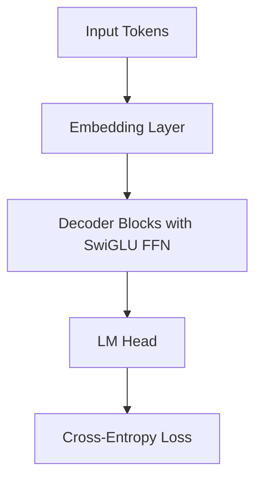

# Autoregressive LLM Base Pre-Training Foundations

SwiGLU is the default non-linear activation architecture within almost all modern autoregressive Large Language Models (LLMs).

## Why SwiGLU is Used in Pre-training

Pre-training models on trillions of tokens is highly sensitive to training instability. Traditional activations like ReLU can cause gradient vanishing or sudden gradient explosions. SwiGLU's smooth mathematical landscape provides several key benefits:
1.  **Stable Gradient Flow:** The smooth gating function prevents sudden updates.
2.  **Increased Model Capacity:** Dual-tower representations improve the model's ability to model complex sequence relationships.
3.  **Faster Convergence:** Empirical evidence shows that SwiGLU achieves lower validation loss in fewer pre-training steps compared to GELU or ReLU.

## Diagram: Pre-training Data Flow with SwiGLU FFN

---
[← Back to README](../README.md)
