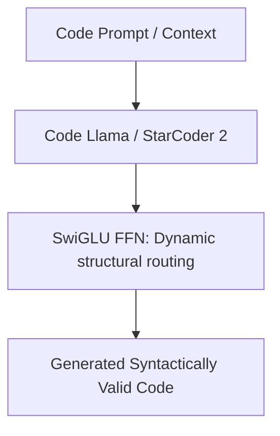

# High-Yield Code Generation & Synthesis Blocks

Specialized code generation models, such as Code Llama and StarCoder 2, require highly robust and expressive activation layers to capture complex structural semantics.

## SwiGLU in Code Models

Coding languages have rigid syntax rules, nesting, and indentation guidelines. Gated linear mechanisms are particularly well-suited for code synthesis because:
1.  **Logical Gating:** The gating branch can learn to switch paths based on structural syntactical triggers (e.g., matching indentation or opening/closing brackets).
2.  **Context Retention:** Gated paths allow long-range variable definitions and function signatures to be routed more effectively through the feed-forward layers.

## Diagram: Code Generation Architecture

---
[← Back to README](../README.md)
