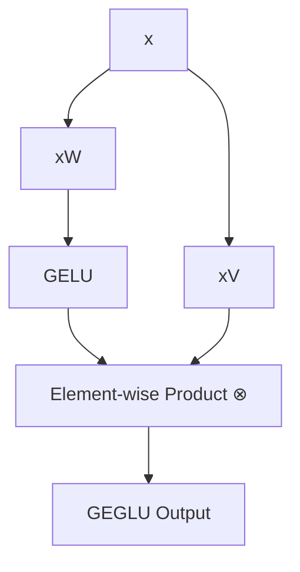

# GEGLU (GELU-Gated Linear Unit)

GEGLU is a variant of a Gated Linear Unit where the non-linear gating function is the Gaussian Error Linear Unit (GELU).

## The Concept

The equation governing GEGLU is:

$$\text{GEGLU}(x) = (\text{GELU}(xW) \otimes xV)$$

Here:
*   $W$ and $V$ are the weight matrices of two parallel linear projection layers.
*   $\otimes$ represents the element-wise multiplication (Hadamard product).
*   $\text{GELU}(z) = z \Phi(z)$ is the gating function.

## Diagram: GEGLU Computation Graph

## Mechanism

GEGLU replaces Swish with GELU as the gating function. It has been widely used in generative vision models (e.g., Stable Diffusion) and some large transformer architectures.

---
[← Back to README](../README.md)
