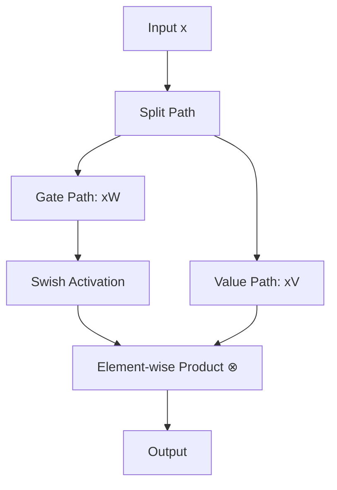

# The Gated Linear Unit Revolution (SwiGLU, 2020–Present)

Noam Shazeer (2020) proposed replacing the traditional position-wise Feed-Forward Networks (FFN) in Transformers with Gated Linear Unit (GLU) variants. The most successful variant has been SwiGLU (Swish-Gated Linear Unit).

## The Concept

The core idea is to split the hidden layer's feature path into two parallel linear matrix operations, pass one path through a Swish activation, and then compute the element-wise multiplication (Hadamard product) between both paths.

$$\text{SwiGLU}(x) = \text{Swish}_{1}(xW) \otimes xV$$

This dual-tower structure allows the network to implement dynamic routing, where the activation value of one path scales the value of the other path.

## Diagram: Dual-Tower Gated Routing

## Significance

SwiGLU has become the standard baseline activation layout for modern frontier architectures like Llama 3, Mistral, Gemma, and DeepSeek, offering faster convergence and better training stability at scale.

---
[← Back to README](../README.md)
