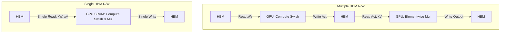

# GPU Memory Bandwidth Bottlenecks

A major latency factor in SwiGLU training is memory bandwidth constraints on the GPU rather than raw floating-point operations (FLOPs).

## The Bottleneck

Executing separate, sequential PyTorch operators for linear projection, Swish exponentiation, and element-wise tensor multiplication forces the GPU to write intermediate data to High Bandwidth Memory (HBM) and read it back for the next operation. This round-trip overhead stalls the GPU execution units.

## Solution: Fused Kernels

Using custom compilers or libraries (e.g., Triton, Liger Kernel), developers write **fused kernels**. A fused kernel combines the up-projections, Swish activation, and Hadamard product into a single GPU executable block. The intermediate states are held in the GPU's fast, on-chip SRAM instead of being written back to HBM, eliminating redundant memory round-trips.

## Diagram: Fused vs. Non-Fused Memory Access

---
[← Back to README](../README.md)
