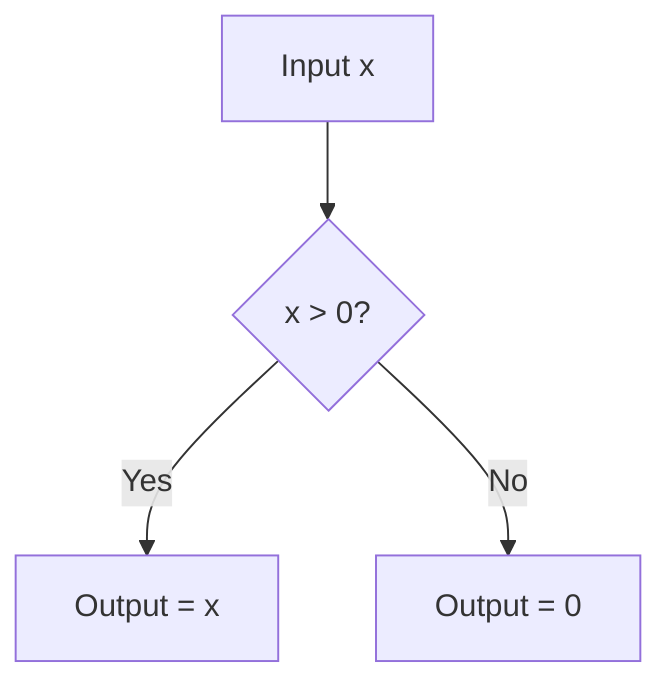

# The Hard Sparsity Era (ReLU, ~2012–2016)

The Hard Sparsity Era began with the wide adoption of Rectified Linear Units (ReLU) in deep neural network architectures like AlexNet (2012). Before ReLU, networks predominantly used saturating activation functions like Sigmoid or Tanh, which suffered from severe vanishing gradient problems in deep layers.

## The Concept

The ReLU activation function is defined mathematically as:

$$f(x) = \max(0, x)$$

This simple function introduces absolute sparsity by completely zeroing out any negative inputs. This sparsity has computational benefits and mimics biological neuron behavior, which either fires or does not.

## Diagram: Sparsity Gating Flow

## The Limitation: Dying ReLU Problem

When a neuron's weights update such that it always outputs negative values for the training data, its gradient becomes zero. Since the gradient is zero, the weights will never update again, rendering the neuron permanently inactive or "dead." In deep networks, a large percentage of neurons can die, reducing the model's overall capacity.

---
[← Back to README](../README.md)
