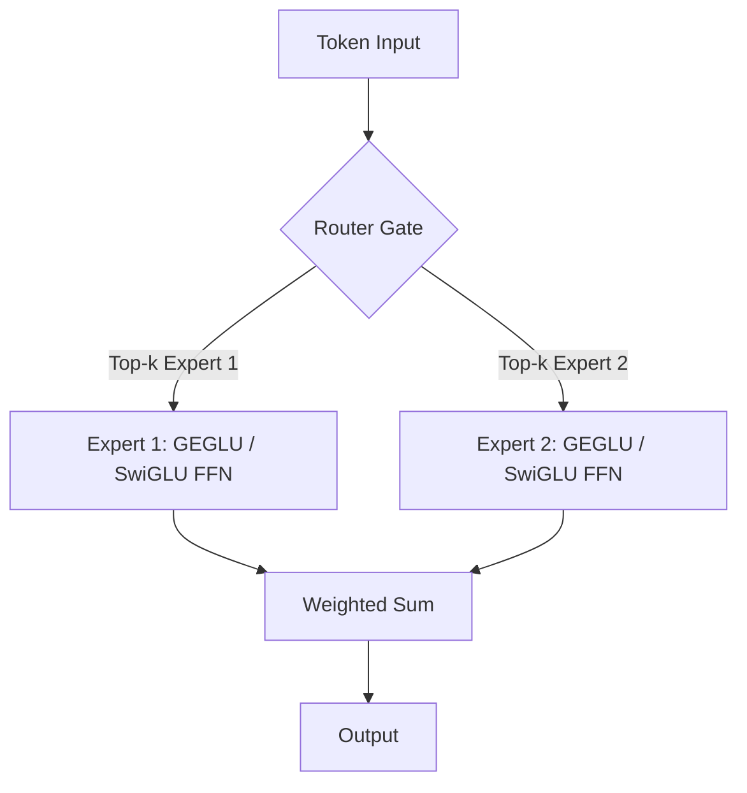

# Mixture-of-Experts (MoE) Token Routing Networks

In massive scale networks like GLaM, DeepSeek-V3, and Mixtral, Mixture-of-Experts (MoE) topologies are used to scale parameter count while maintaining active compute constant.

## Gated activations in MoE

An MoE layer routes each input token to a subset of available "expert" networks. Each expert is typically structured as a Feed-Forward Network. 
By employing gated linear architectures (like GEGLU in GLaM, or SwiGLU in DeepSeek-V3) within the expert networks:
1.  **High-Capacity Specialized Representation:** The gate within each expert dynamically filters which dimensions of the token's features are processed by that expert.
2.  **Smooth Routing Compatibility:** The continuous gating output integrates cleanly with the top-k router's soft gating weights.

## Diagram: MoE Gated Expert Routing

---
[← Back to README](../README.md)
