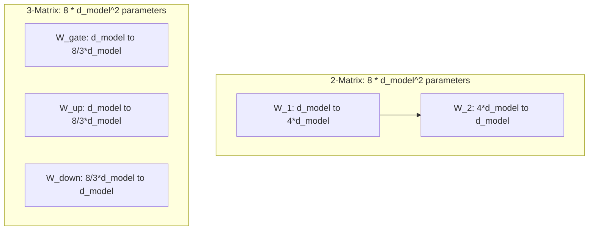

# Parameter Budget Calibration

Because SwiGLU requires three weight matrices instead of two, it introduces extra parameters. To maintain a fair comparison and match the computational/parameter budget of standard architectures, researchers calibrate the intermediate dimension size.

## The Calibration Formula

In a standard FFN layer with intermediate hidden capacity $d_{ffn} = 4d_{model}$, the total number of parameters is:

$$\text{Params}_{\text{std}} = 2 \times d_{model} \times 4d_{model} = 8d_{model}^2$$

In a SwiGLU FFN layer, we have three matrices: $W_{gate}$, $W_{up}$, and $W_{down}$. If we kept $d_{ffn} = 4d_{model}$, the parameter count would be:

$$\text{Params}_{\text{uncalibrated}} = 3 \times d_{model} \times 4d_{model} = 12d_{model}^2$$

To keep the parameter count equivalent to the traditional layout ($8d_{model}^2$), the intermediate dimension $d_{ffn}$ must be scaled down:

$$3 \times d_{model} \times d_{ffn} \approx 8d_{model}^2 \implies d_{ffn} \approx \frac{8}{3}d_{model}$$

In practice, to ensure hardware efficiency (like tensor-core friendliness), $d_{ffn}$ is usually rounded to the nearest multiple of 128 or 256.

## Diagram: Parameter Parity Comparison

---
[← Back to README](../README.md)
