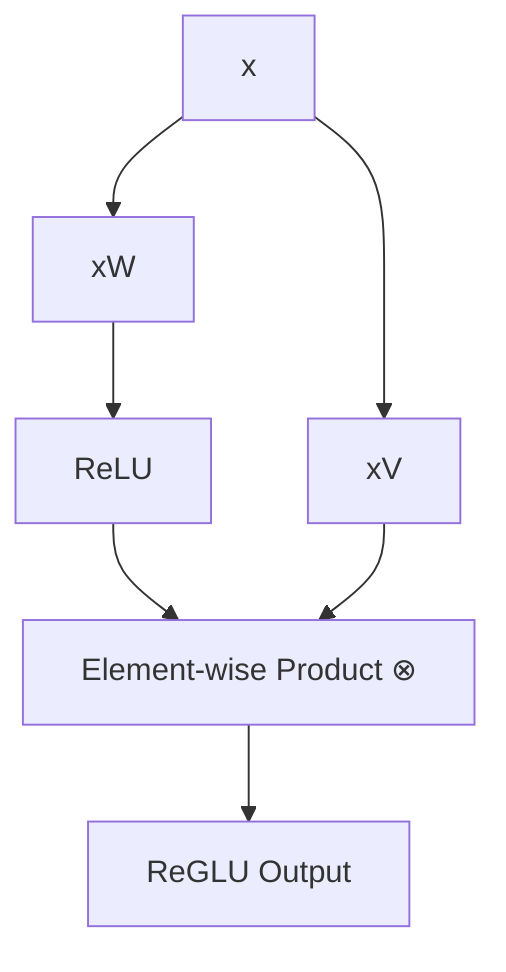

# ReGLU (ReLU-Gated Linear Unit)

ReGLU is a variant of a Gated Linear Unit where the non-linear gating function is the Rectified Linear Unit (ReLU).

## The Concept

The equation governing ReGLU is:

$$\text{ReGLU}(x) = (\max(0, xW) \otimes xV)$$

Here:
*   $W$ and $V$ are the weight matrices of two parallel linear projection layers.
*   $\otimes$ represents the element-wise multiplication (Hadamard product).
*   $\max(0, z)$ is the ReLU gating function.

## Diagram: ReGLU Computation Graph

## Mechanism

ReGLU combines classical hard-zero sparsity parameters with modern bilinear multi-path structures. By using ReLU in the gate, it allows parts of the gating layer to be completely deactivated, offering a trade-off between strict sparsity and dual-tower expressiveness.

---
[← Back to README](../README.md)
