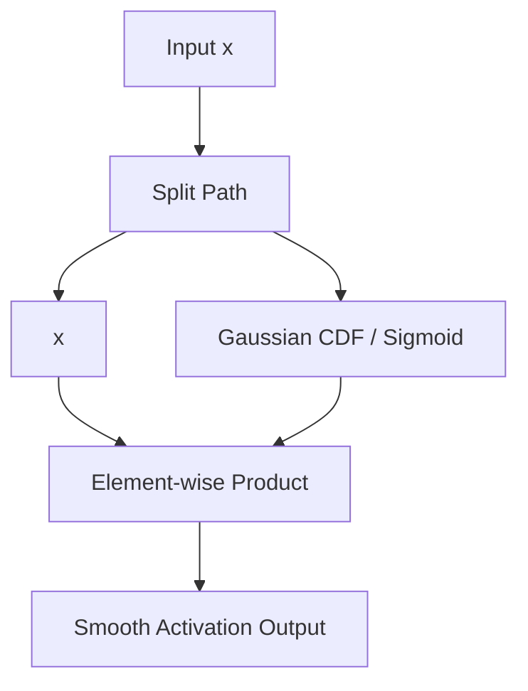

# The Smooth Stochastic Era (GELU / Swish, ~2016–2020)

To overcome the limitations of the hard-thresholding ReLU activation, researchers introduced smooth, non-monotonic curves that allow minor negative activations to propagate. This era saw the introduction of GELU (Gaussian Error Linear Units) and Swish (SiLU).

## The Concept

### Gaussian Error Linear Unit (GELU)
GELU scales inputs by a cumulative Gaussian distribution function, introducing stochasticity by gating inputs by their value rather than their sign:

$$\text{GELU}(x) = x \Phi(x) = x \cdot P(X \le x), \text{ where } X \sim \mathcal{N}(0, 1)$$

### Swish (SiLU)
Swish implements a parameterized sigmoid multiplication:

$$\text{Swish}(x) = x \cdot \sigma(\beta x) = \frac{x}{1 + e^{-\beta x}}$$

When $\beta = 1$, it is equivalent to the Sigmoid Linear Unit (SiLU).

## Diagram: Smooth Gating Curve

## The Limitation

While smooth stochastic activations improved learning dynamics and became standard in models like BERT and GPT-2, they operate on single, isolated tensor inputs, missing out on the multi-dimensional feature-routing capabilities found in gated network topologies.

---
[← Back to README](../README.md)
