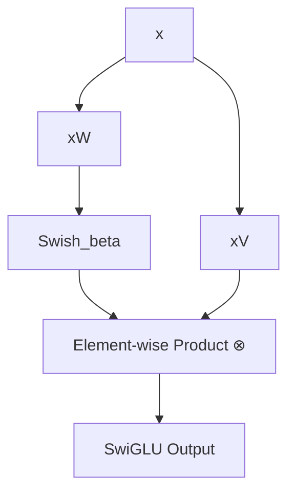

# SwiGLU (Swish-Gated Linear Unit)

SwiGLU is a specific formulation of a Gated Linear Unit where the non-linear gating function is chosen to be the Swish (or SiLU) activation function.

## The Concept

The equation governing SwiGLU is:

$$\text{SwiGLU}(x) = (\text{Swish}_{\beta}(xW) \otimes xV)$$

Here:
*   $W$ and $V$ are the weight matrices of two parallel linear projection layers.
*   $\otimes$ represents the element-wise multiplication (Hadamard product).
*   $\text{Swish}_{\beta}(z) = z \cdot \sigma(\beta z)$ is the gating function.

## Diagram: SwiGLU Computation Graph

## Mechanism

SwiGLU uses the Swish activation as a smooth, non-monotonic gate. The gating layer determines which components of the parallel value matrix $xV$ are amplified or suppressed, facilitating high-capacity multi-dimensional routing.

---
[← Back to README](../README.md)
