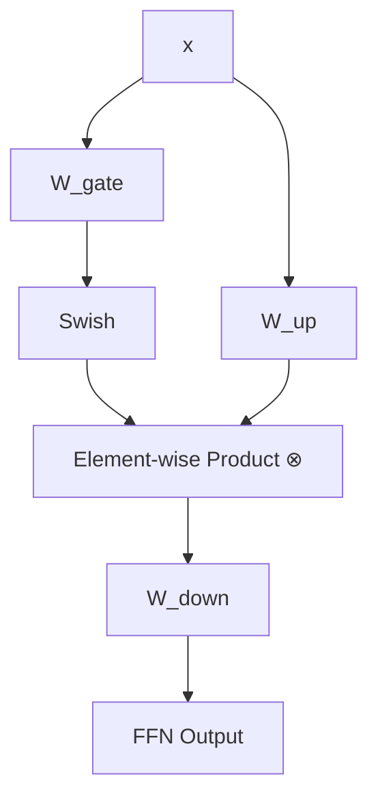

# The 3-Matrix FFN Shift

Integrating a GLU-style activation function changes the structural layout and weight matrix distribution of the Feed-Forward Network (FFN) layers in Transformers.

## Traditional vs. SwiGLU FFN

### Traditional FFN Layout
A standard Transformer FFN layer (e.g., using ReLU or GELU) relies on two linear projections:
1.  **Up-Projection ($W_1$):** Projects input to intermediate dimension $d_{ffn}$.
2.  **Down-Projection ($W_2$):** Projects intermediate output back to $d_{model}$.

$$\text{FFN}_{\text{standard}}(x) = \text{Activation}(xW_1)W_2$$

### SwiGLU FFN Layout
To implement the dual-tower gating mechanism, SwiGLU requires **three separate weight matrices**:
1.  **Gate Matrix ($W_{gate}$ or $W$):** Computes the gating channel representation.
2.  **Up-Projection ($W_{up}$ or $V$):** Computes the parallel value channel representation.
3.  **Down-Projection ($W_{down}$ or $W_2$):** Combines the gated product and projects it back to $d_{model}$.

$$\text{FFN}_{\text{SwiGLU}}(x) = (\text{Swish}(xW_{gate}) \otimes xW_{up}) W_{down}$$

## Diagram: SwiGLU 3-Matrix FFN Architecture

---
[← Back to README](../README.md)
