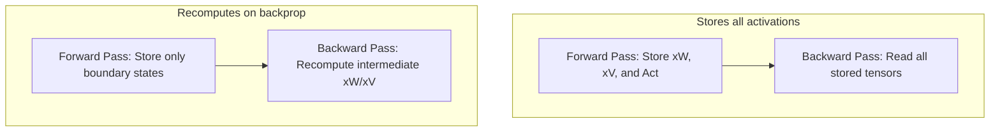

# The VRAM Memory Footprint Inflation

While SwiGLU offers higher representational capability, it poses production challenges by increasing activation memory usage during training.

## The Memory Inflation Problem

During the forward pass of a SwiGLU FFN:
1.  Both $xW$ and $xV$ matrices are computed and stored in memory.
2.  The activation function $\text{Swish}(xW)$ is computed and stored.
3.  The element-wise product $(\text{Swish}(xW) \otimes xV)$ is computed.

Because these intermediate tensors must be preserved to compute gradients during the backward pass, training memory consumption increases dramatically compared to a traditional single-layer activation model.

## Mitigation: Activation Checkpointing

Instead of saving all intermediate tensors during the forward pass, **Activation Checkpointing** (gradient checkpointing) stores only specific boundary states. During backpropagation, the discarded intermediate states (like $xW$ and $xV$) are recomputed on-the-fly, trading extra computation time (~30%) for significant memory savings.

## Diagram: Standard vs. Checkpointed Memory

---
[← Back to README](../README.md)
